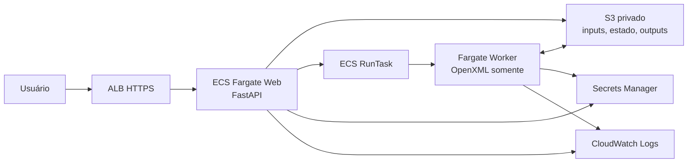

# Arquitetura AWS

## Decisao para a v1

O site permanece em um ECS Fargate Service de uma unica replica, atras de ALB com HTTPS. Ele recebe arquivos, mostra a interface e acompanha o status. As operacoes caras (`preview` e `generate`) iniciam uma nova task ECS Fargate por job usando `RunTask`.

O estado de cada job e um conjunto de objetos no S3 em `auto-ppt/jobs/<job_id>/`. S3 tem consistencia forte para PUT/GET, portanto o web e o worker podem trocar o estado do job sem EFS, DynamoDB ou disco compartilhado.

O worker nunca chama Office, COM, LibreOffice ou um renderizador de slides. Ele analisa XLSX, atualiza somente as partes OpenXML permitidas e envia o resultado ao S3.

## Contratos preservados

- Não usar `python-pptx chart.replace_data()`.
- Não salvar o workbook embutido inteiro com `openpyxl.save()`.
- Preservar ZIP/OPC e substituir apenas `chart.xml`, o workbook embutido e XML de tabelas que o plano exigir.
- Fórmulas de XLSX passam pelo avaliador interno restrito; uma fórmula fora do contrato interrompe o job por padrão.
- Cada chamada ECS usa o `job_id` como token idempotente e não executa duas vezes o mesmo tipo de operação para o mesmo job.

## Serviços necessários agora

- ECS Fargate: web contínuo e workers sob demanda.
- Application Load Balancer + ACM: URL estável, HTTPS e health checks.
- S3: projetos, checkpoints, arquivos de job e PPTs gerados.
- ECR: imagens versionadas por commit/digest.
- Secrets Manager: chave OpenAI, se IA estiver ativada.
- CloudWatch Logs: logs separados de web e worker.
- IAM: task role com S3 e permissão restrita para o web chamar somente o task definition do worker.

Não é necessário SQS, DynamoDB, EFS, NAT Gateway ou banco relacional para a v1. Isso evita custo fixo e complexidade. SQS + DynamoDB entram quando for preciso limitar concorrência, consultar histórico por filtros mais ricos ou disparar muitos jobs simultâneos.

## Segurança e rede

As tasks têm IP público somente para saída sem NAT Gateway; o security group da task não recebe tráfego da Internet, apenas do ALB para o container web. O script exige um CIDR corporativo/VPN e bloqueia `0.0.0.0/0` enquanto não houver autenticação. Para abrir o produto a usuários externos, configure autenticação OIDC/Cognito no listener do ALB antes de ampliar o CIDR.

## Operação

1. A web valida tamanho e estrutura ZIP de PPTX/XLSX.
2. Salva o job no S3 e inicia o worker Fargate.
3. O worker baixa o job para `/tmp`, processa e publica os estados JSON no S3.
4. A interface consulta o estado, hidrata o resultado e permite revisão.
5. Ao gerar, uma nova task worker monta o PPT final e publica `generated.pptx`.

Tasks Fargate são faturadas por segundo enquanto executam; mantenha o web sempre ligado somente porque a interface FastAPI atual é server-rendered. Quando houver motivo de produto para reescrever a interface em SPA, ela pode ir para S3 + CloudFront e o web contínuo pode ser substituído por APIs leves.
